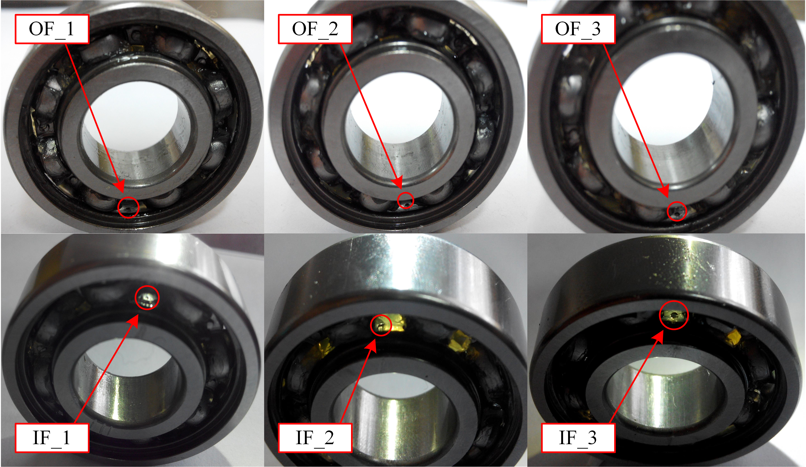

# Rolling Bear Speed Dataset and Speed Curve Extraction (Python Environment)

The package includes: rolling bearing speed dataset and speed curve extraction program, which is a Python program.  
Regarding the integrated environment of Python, I mainly use Winpython under Windows, with IDEA as spyder (similar to MATLAB interface).  
Which is better, Winpython or Anaconda?  
Winpython, derived from pythonxy, is aimed at scientific computing, balancing data analysis and mining;  
Anaconda is primarily for data analysis and mining, with its own unique packages in big data processing;  
Winpython emphasizes portability, becoming green software without writing to the registry, installation is actually unzipping to a folder, moving the folder can even be put on a USB drive and used on other computers;  
Anaconda is traditional software mode.  
Winpython is maintained by individuals;  
Anaconda is maintained by an analytical data services company, meaning Winpython has many aspects that are simplified, while Anaconda provides some humanized settings.  
Winpython can only be used on Windows, while Anaconda has a Linux version.  
Note:  
1. The code has been tested and there are no problems.  
2. Please read the work description carefully before purchasing, as it is very important because it involves different programming languages (Python or MATLAB).  
3. This code is a special product, sold after purchase, refunds will not be processed, if you have any questions please contact us in time.  
5. There is no explanation of this code.

Sorry, as a text-based AI model, I'm not capable of visually processing or translating images. If you have any specific questions about image processing or related technology, feel free to ask!

Here is a pay link on Stripe ( https://buy.stripe.com/3cs8yP7sY87d0vu9AB ). Please contact me lonlonago@foxmail.com after funding $89, and I will send you a complete data files , thank you!

